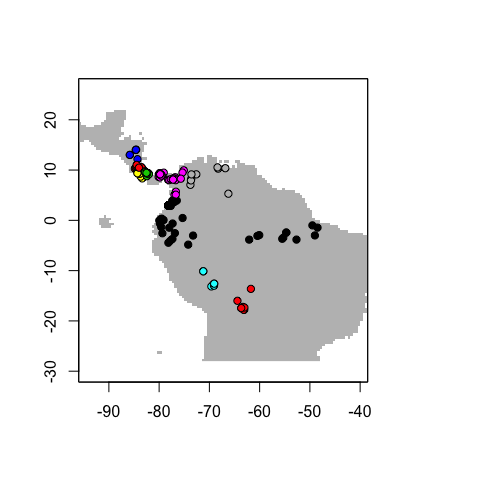

## Time series data

```{r}
ts_data_raw <- read.csv("../data/daily_temps.csv")
```

```{r}
ts_data_raw
```

```{r}
class(ts_data_raw)
```


```{r}
ts_data <- ts_data_raw
ts_data$Date <- as.POSIXct(ts_data$Date)
class(ts_data)
```

```{r}
plot(ts_data)
```


```{r}
library(prophet)
```


```{r}
library(dplyr)

ts_data_prophet <- ts_data_raw %>%
  rename(ds = Date, y = Temp)
m <- prophet(ts_data_prophet)
```


```{r}
m
```


```{r}
future <- make_future_dataframe(m, periods = 365 * 2)
future
```


```{r}
forecast <- predict(m, future)
```

```{r}
tail(forecast)
```


```{r}
plot(m, forecast)
```

```{r}
prophet_plot_components(m, forecast)
```

## Spatial data

Spatial data visualisation:

https://rstudio.github.io/leaflet/

```{r}
library(leaflet)

data(quakes)

# a working path to icon & shadow, hosted on https://cdnjs.com/libraries/leaflet
marker_icon <- makeIcon(
  iconUrl = "https://cdnjs.cloudflare.com/ajax/libs/leaflet/1.8.0-beta.0/images/marker-icon.png",
  shadowUrl = "https://cdnjs.cloudflare.com/ajax/libs/leaflet/1.8.0-beta.0/images/marker-shadow.png",
)

leaflet(data = quakes[1:20,]) %>%
  addTiles() %>%
  addMarkers(~long,
             ~lat,
             icon = marker_icon,
             popup = ~as.character(mag),
             label = ~as.character(mag))
```


```{r}
library(sdmbench)

benchmarking_data <- get_benchmarking_data("Loxodonta africana", limit = 1200, climate_resolution = 10)
```


```{r}
plot(benchmarking_data$raster_data$climate_variables$bio1)
```


Source: http://cran.nexr.com/web/packages/ENMeval/vignettes/ENMeval-vignette.html